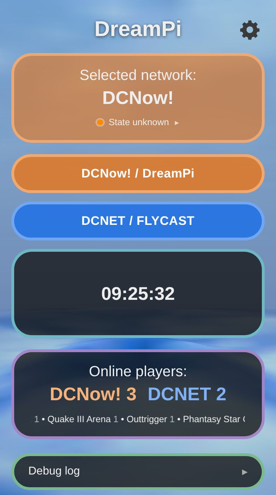

# DreamPi Netswitch

An add-on for [DreamPi](https://github.com/Kazade/dreampi), the Raspberry Pi bridge that takes a Sega Dreamcast online through its modem. It needs a working DreamPi and doesn't do anything on its own.

Switch a DreamPi between **DCNow!** (the normal DreamPi / Dreamcast Live network) and **DCNET** (Flycast's network) from a web page, or by dialing special numbers from the Dreamcast.

It changes no DreamPi files, so DreamPi's auto-updates keep working and uninstalling leaves DreamPi exactly as it was.

<p align="center"></p>

What you get:
- A live status page at `http://dreampi.local` (also over HTTPS) with buttons to pick the network.
- Special phone numbers that switch the network straight from the Dreamcast (only `11111` to start with: it selects DCNow! and connects).
- Optional status LEDs, on GPIO18 by default or GPIO10/12/21: one NeoPixel, several, or a strip. They show DreamPi's status and network or internet problems: you build colour rows from 40 or so messages (announced by the modules), with effects (solid, blink, fade, breathe, short / double / triple blink, rainbow), a priority that is simply the order of the rows (drag to reorder), LED sections, a colour of your own per palette colour and a quick white-balance calibration.
- Two GPIO buttons (always installed, each with its own pin and function, such as toggling the network), and optional Wi-Fi setup (`--wifi`): hold a button for 3 seconds and the Pi hosts a temporary "DreamPi WiFi Config" Wi-Fi network with a page to pick and connect to your home Wi-Fi, no keyboard or monitor needed.
- An optional openMenu link: the games on the Dreamcast's SD card on the page, with a button to start one on the Dreamcast (pairs with an openMenu build that talks to the Pi).
- An optional animated Dreamcast-style background for the page.
- A clock (12 or 24-hour, `.beat`, world times and a time zone map), the coming DC99 community events with reminders, an online players box (who is on DCNow! and DCNET, and in which games, with favourite games and players), and a debug log for tracking down calls that go wrong.
- Update and reboot buttons on the page, and an optional PIN for them.
- Modem plugged-in detection and its make/model, with a warning if it's not a modem known to work with DreamPi.

**Tested so far:** DreamPi 2.1 on a Raspberry Pi 3 with openMenu 1.7.0. The add-on loads under DreamPi's Python 2.7, and switching to DCNET by dialing a number (`555-0002` in that test; it is no longer a default) works end to end. The Toggle numbers (switch only, with the busy tone) haven't been tried on hardware yet. A single NeoPixel on GPIO18 works too. Several LEDs or a strip, the LED colour calibration/wire order, the steady no-flicker output, the GPIO10/12/21 output pins, and the Wi-Fi setup button (including the newer second button, per-button function and combined-hold assignment), haven't been tried on real hardware yet; feedback is welcome.

## Install

On the Pi:
```
git clone https://github.com/blaskkaffe/DreamPiAutoToggle.git
cd DreamPiAutoToggle
sudo ./install.sh
```
Then open **http://dreampi.local** or **https://dreampi.local** in a browser on the same network. If `dreampi.local` doesn't resolve on a device, use the Pi's IP address instead.

### HTTPS

Some browsers refuse or keep upgrading plain `http://` pages, so the page is also served over HTTPS on port 443. A Pi on a home network can't get a certificate from a public authority, so the installer makes its own (self-signed) certificate:

- The first time you open `https://dreampi.local`, the browser warns that the connection isn't private. Choose **Advanced** and **Proceed** (the wording varies); most browsers remember that choice for the site.
- The traffic is still encrypted; the warning only means no public authority vouches for the certificate.
- The certificate is valid for about 2 years (Apple devices won't accept longer). Running the installer renews it when it has less than 30 days left.
- `http://` keeps working as before.

Options:
- `sudo ./install.sh 8080` puts the HTTP page on another port, if port 80 is taken.
- `sudo ./install.sh --https-port=8443` puts the HTTPS page on another port, and `--no-https` turns it off.
- The status NeoPixel is on by default (1 LED on GPIO18). `sudo ./install.sh --leds=30` sets the starting count for a chain or strip of 30 (the count can also be changed later in Settings), and `--leds=0` turns the LEDs off and hides the LED settings; `--led-gpio=10`/`12`/`21` uses a different pin than the default GPIO18 (see [Status NeoPixels](#status-neopixels-optional)). The older `--led`, `--led=N` and `--no-led` still work.
- Every install makes sure `hostapd` and `dnsmasq` are installed (with `apt`, only if missing), because Wi-Fi setup needs them to host its temporary access point. `sudo ./install.sh --wifi` switches Wi-Fi setup on: the temporary access point for joining a network without a keyboard, plus its Settings controls and the button hold that starts it (see [Wi-Fi setup button](#buttons-and-wi-fi-setup)); you can also switch it on in Settings > System > Modules. `--no-wifi` switches it off again. To try the Wi-Fi flow without any Wi-Fi hardware, `--wifi-demo` runs Wi-Fi setup on dummy networks (password `demo` connects, anything else fails) without touching the Pi's network; `--no-wifi-demo` ends it. The two buttons themselves (GPIO17 and GPIO4 by default) are always installed.

- `sudo ./install.sh --pin` asks for a PIN (`--pin=1234` gives it on the command line, which shows in the shell history); `--no-pin` removes it. See [Safety](#safety).

Options can be combined, for example `sudo ./install.sh --leds=8 --no-https`.

### Update

The page can do it for you while the **Reboot and Update** module is on (see [Modules](#modules)): **Settings > System** (the Updates row) checks GitHub for a newer version of this add-on (and tells you if DreamPi has newer scripts), and **Update now** fetches and installs it from the checkout you installed from (settings and ports are kept; the page is gone for a few seconds). By hand, which is what the rest of this section describes:

```
cd ~/DreamPiAutoToggle && git pull && sudo ./install.sh
```
DreamPi itself needs no manual update: it updates its own scripts when the Pi starts and has internet (restart the Pi to get a newer version). If `/boot/noautoupdates.txt` exists it does not update itself; remove that file first.

Your settings are kept: which modules are on, the LED setup and its colours, and the HTTPS certificate. An install from before the modules were folders is converted by the update: its old flat files are removed and the modules are installed from `modules/` (an old Wi-Fi setup install stays on). You don't need to repeat `--leds=N`, `--wifi` or the port options; the installer remembers them (`--leds=0` / `--no-wifi` switch them off, `--https-port=443` turns HTTPS back on after `--no-https`). If the page still looks old afterwards, reload it in the browser.

### Safety

The web page runs on the Pi as root, because it has to restart DreamPi, reboot the Pi and run the updater. There are no user accounts: **anybody who can reach the page on your network can use it**, so only put the Pi on a network you trust, and don't forward its ports from the internet. What the add-on does to limit the risk:

- **PIN (optional).** `sudo ./install.sh --pin` sets a PIN that the page asks for (once per page load) before **Update now**, **Reboot** and **Wi-Fi connect**. It is stored only as a salted hash, and five wrong tries lock the protected actions for a minute. The PIN can also be set, changed or removed in **Settings > Appearance > PIN** (changing or removing it asks for the old one); note that while no PIN is set anybody on your network can set one there, which is why `sudo ./install.sh --no-pin` stays as the way back. **Ask for the PIN to open Settings** (same box) locks Settings: the cogwheel asks for the PIN first (closing Settings locks it again), and the service itself then refuses every setting that is changed without the PIN. The dashboard keeps working without it: the network buttons (also openMenu's), Hang up, the stars and bells, Start / Join. Reading is not locked: the settings' values can still be looked up by someone who calls the page's data addresses directly. Use the `https://` address when you use a PIN: over plain `http://` the PIN travels unencrypted. Forgot it? `sudo ./install.sh --no-pin`. Without a PIN, anybody on your network can update or reboot the Pi.
- **Other websites can't use it.** Every change (all `POST`s) must come from the page itself: a request from another site (a form or script on a web page you have open in your browser) is refused, and so is a request that reaches the Pi under a name that isn't the Pi's (the trick used to attack devices on a home network from a web page). The page answers to IP addresses, `dreampi.local`-style names and the Pi's own host name; if your router gives it another domain name and the page says "Unknown host name", list that name in `/opt/dreampi-netswitch/allowed_hosts` (one per line). The page can't be shown inside another site's frame.
- **Update now is limited to GitHub.** It only pulls from the git address the checkout had when the add-on was installed (it must be a GitHub address, and a changed one is refused), fetches from exactly that address, and only fast-forwards, so it can't pull in changes that don't continue your copy.
- **The web service is fenced in** (systemd: no new privileges, read-only `/usr`, `/boot` and `/etc`, no kernel-module or cgroup changes) and the add-on's files in `/opt/dreampi-netswitch` are root-owned.
- **Not covered:** someone who is already logged in on the Pi (or can run code on it) can do more than this add-on ever could, and the status files in `/tmp` are guessable names (the update's status file is not written through a planted link). The Wi-Fi setup access point is open by design while you set up Wi-Fi: it closes itself after 10 minutes if nobody picks a network, but don't start it where you don't want others to join.

### Modules

The add-on is a small **base** plus **modules**. The base (`base/`) is a small framework that knows nothing about this project: the web page's frame and theme (the global colours and the look every module shares), the module picker and the settings every page has (colour palette, screen layout, theme, PIN); it could carry a completely different set of modules (the project's name, icons and folders are in `project.json`). The hook inside DreamPi that does the routing belongs to the network switcher module. Each module owns its code, its services and its state files, and modules never import each other (see [docs/modules.md](docs/modules.md)). **Everything the page shows is a module**, a folder in `modules/` that describes its boxes in a `layout.json`; the page reads the folders and draws them. Two modules are always on (they are in the picker, to be moved, but have no switch): the **DreamPi Network Selector** (the Selected-network box, the two network buttons, the colours of the networks, and the GPIO settings of the two physical buttons) and **About** (the versions and a GitHub link). The others you can switch and move:

| Module | Folder | Adds | On by default |
|---|---|---|---|
| *DreamPi Network Selector, About* | `modules/switcher/`, `system/` | always on (they can be moved in the picker, not switched off); the network box and buttons, the Network Selector colour in Appearance, the Global colours box (network colours, Global main, Notification highlight) and the GPIO settings of the two physical buttons (switcher); the About box with versions and the GitHub link (About) | yes |
| **Special phone numbers** | `modules/numbers/` | Settings > Special phone numbers, to edit the rows (action + numbers) the Dreamcast dials. Without it the built-in default row is used | yes |
| **Clock** | `modules/clock/` | the time on the main page in an info box like the network and players boxes: the middle line is the time as 12h, 12h am/pm or 24h, in the time zone set in Settings > About (the Pi's own, or one picked from a list of cities; summer and winter time follow it); the top line is empty or the .beat time as "@600 .beats" (Swatch Internet Time); the bottom line is empty or a scrolling list of world times (each city with its time). With world time on, tapping the box shows the cities with their times and a map of the time zones: the map is a simple hand-drawn world on 24 time zone bands, with the current hour of each band along the top and its UTC offset along the bottom (same size), the clock's own band highlighted and a dot for each city. The clock's own place is a **white dot**, and its band is the one the place is really in: summer time does not move it into the next band, and the band's hour is the clock's own time. **Large clock** makes the time fill the rows that .beat and world time leave free (all three rows with neither on, two with one on; with both on it is the middle row). Settings > Clock: the format (a pop-up of three buttons: 12h, 12h am/pm, 24h), switches for .beat, world time and Large clock, and one **Cities** row with an **Edit** button: its pop-up has the world time list (remove any, add from the list, up to 12; Restore brings back the ten you start with); the clock's colour is in Settings > Appearance | yes |
| **DC99 events** | `modules/events/` | the coming community events from [dc99.net](https://dc99.net/community/) (Sega Online Discord, DreamcastLive and DC99's own) in a box on the main page; tap it for the next two weeks, each event with a **bell** that sets a reminder. Settings > DC99 events: how long before an event the reminder starts, how often it syncs with DC99 (the times are shown in the time zone of Settings > About), and **Always remind me of** (whole series, such as every *US Game Night*). A reminder shows as a banner at the top of the page, makes the clock box (and the events box) stand out, and lights the LED message *Event starting soon*. Also a JSON API for other programs ([docs/events.md](docs/events.md)) | yes |
| **Online players** | `modules/players/` | the Online players box on the main page | yes |
| **openMenu link** | `modules/openmenu/` | the openMenu link box on the main page: the games on the Dreamcast's SD card with a **Start** button each, a Join button in the Online players and events lists, and live info back to the Dreamcast (see [openMenu link](#openmenu-link)) | yes |
| **Wi-Fi setup** | `modules/wifi/` | joining a Wi-Fi network without a keyboard (a temporary access point), and the Wi-Fi rows in Settings | no |
| **Status LEDs** | `modules/led/` | the NeoPixel service, the Status LED settings (colour rows with their messages and effects, in priority order, the per-colour LED values and the white-balance calibration), and the LED count / GPIO pin / wire order | yes |
| **Dreamcast background** | `modules/background/` | the animated Dreamcast menu background behind the page (see [Credits](#credits)) | no |
| **Background image** | `modules/imagebg/` | a picture of your own as the page's background. Switch it on in Settings > Appearance, then **Settings > Background image**: **Choose** a picture from the phone or computer (PNG, JPEG, GIF or WebP; a big one is shrunk in the browser to at most 2560 px before it is sent, 8 MB is the most the Pi takes), **Fit** (cover the screen, show it whole, stretch, tile) and **Darken** (off, 25, 50 or 75 %, so the text stays readable); **Remove** takes it away. The boxes turn a little see-through over it. It is a background like the Dreamcast one: the first background in the picker order is the one drawn, so with both on, move this one above the Dreamcast background. Tested in a headless browser only | no |
| **Reboot and Update** | `modules/rebootupdate/` | the Updates rows (check GitHub, **Update now**) and the Reboot row, both in the System box | yes |
| **Snow background** | `modules/snow/` | a snowstorm in soft fog behind everything (3D, WebGL), with a day and night that follow the time zone. Switch it on in Settings > Appearance, then Settings > Snow background has the amount of snow, wind, fog and time of day | no |
| **Debug log** | `modules/debuglog/` | the Debug log box on the main page (closed: the title and the last three lines of the log, or Recording off; tap it for the buttons and the live log, which fills the width of the box) and its recording inside DreamPi | no |

- **Switch one on or off, and set its priority:** Settings > **System** > **Modules** > **Edit**. A tick box switches it: the page reloads without the module's parts, and its endpoints and background work stop (the LED service goes dark while Status LEDs is off). Nothing is deleted, so switching it on again brings your settings back. Drag a module by its handle (⋮⋮) to move it up or down the list (on a phone, hold the handle and drag; with a keyboard use the arrow keys on the handle), then press **Done**; nothing is applied before that. **The top of the list has priority**: its boxes come first, it names a box that several modules share (for example the GPIO box holds the buttons' rows, the LED row and the Wi-Fi row), and where two modules want the same thing, such as a background, the one on top wins. A fullscreen background hides the ones under it; a background that only fills a strip (a taskbar or a logo) lets the next one show too.
- **Remove one for good:** delete its folder in the folder you installed from and run `sudo ./install.sh`. The installer removes the installed copy (and, for the LEDs and Wi-Fi setup, their `dreampi-netswitch-led` and `dreampi-netswitch-wifi` services and, for the LEDs, the SPI setting they added); settings files such as `led.json`, the LED count and pin, and `numbers.json` stay for when it comes back.
- **Add one:** put its folder in `modules/` and run `sudo ./install.sh`. A module you wrote or got from someone needs a `module.json` (name, description, enabled by default, visible in the picker) and a `layout.json` with its boxes (see `docs/modules.md`). Modules are built from the page's standard widgets (rows, buttons, forms, tables, lists, consoles ...) and one global palette of 16 colours, so a visual change in the base changes every module and new ones look the same.
- **Without running the installer:** the page follows the folders in `/opt/dreampi-netswitch/modules` while it runs, so copying or deleting a module folder and reloading the page is enough for the page and its endpoints. The LED and Wi-Fi services are only installed or removed by the installer; if their files are deleted from `/opt/dreampi-netswitch`, systemd just skips it instead of failing.
- `--leds=N`, `--led-gpio=N` and `--no-led` do nothing without the LED module, and `--wifi`, `--no-wifi` and `--wifi-demo` do nothing without the Wi-Fi module. `--wifi` switches the Wi-Fi module on, the same as its switch in Settings > System > Modules (hostapd and dnsmasq are installed by every install, not only with `--wifi`).

### Uninstall

```
sudo /opt/dreampi-netswitch/uninstall.sh
```
This removes all the add-on's services (page, buttons, LEDs, Wi-Fi setup), the hook, all settings and the certificate (and an SPI setting it added to `config.txt`), and restarts DreamPi.

## Requirements

- A working [DreamPi](https://github.com/Kazade/dreampi) 2.x on a Raspberry Pi, with the Dreamcast already able to connect through it.
- The current `netlink.py` ([eaudunord/Netlink](https://github.com/eaudunord/Netlink), `dpi2` branch), which DreamPi 2.x downloads itself and which contains DreamPi's DCNET support.
- DCNET enabled in `netlink_config.ini` (`[DCNet]` with `enabled = yes`).
- `/boot/noautoupdates.txt` must **not** exist, otherwise `netlink.py` skips its config and DCNET stays off.

If DCNET isn't available, the web page says so and every call goes to DCNow!.

## Phone numbers

Phone numbers work in **rows**. A row is an **action**, the **numbers** that trigger it and an option to **hang up** (don't answer the call). You edit them in **Settings > Special phone numbers**: each row has an **Edit** button (its pop-up has the action, the *Hang up after the action* switch, the numbers with their ✕ and an Add field, **Delete row** and **Done**), **Add row** asks which action it should run and opens the new row, **Restore default rows** puts the starting row back and the **(i)** button shows the rules. The action list is built from every module that announces actions (a module lists them in its `module.json`, see [docs/modules.md](docs/modules.md)); the **DreamPi Network Selector** has three:

| Action | What it does |
|---|---|
| **Toggle network** | Switch to the other network (DCNow! becomes DCNET and the other way round) |
| **DCNow!** | Select DCNow! / DreamPi |
| **DCNET** | Select DCNET / FLYCAST |

Without *Hang up* the call goes on and connects through the network that is now selected; with it the add-on hangs up instead (the old "Toggle" numbers). A number can be in several rows: then all of them run, in the order of the rows, and any row that hangs up ends the call. The longest matching number decides which number was dialed. One row exists from the start: **DCNow!** with `11111`, no hang up: dialing it selects DCNow! again and connects, which is how you get back to DCNow! by phone (a short run of ones, because a long repeated run is easy for the modem to mishear).

**openMenu** always dials `111-1111`. That ends with `11111`, so the default row also catches openMenu: it selects DCNow! and connects (DCNET does not accept openMenu's login, so keep that row; the page says so under the rows if no row catches it). Any other number connects to the currently selected network. The rows of an older version (four lists: Toggle DCNow!, Toggle DCNET, Call DCNow!, Call DCNET) are turned into rows the first time they are read.

**Hang up:** DreamPi doesn't answer. The add-on changes the selection and plays a busy tone for 4 seconds, which is meant to make the Dreamcast give up straight away instead of waiting for an answer (not yet confirmed on real hardware). After that the normal dial tone comes back and the next call goes to the newly selected network. Use it to change networks from the Dreamcast without opening the web page.

**What counts as a number:** digits, `*` and `#`, 3 to 12 characters, either a whole number or just an ending, for example `*61#` or `0002`. A number counts when what the Dreamcast dialed **ends with** it, so a leading `1` (long-distance prefix), an area code, an outside-line digit or other digits the ISP config puts in front don't matter (DreamPi often hears an extra leading `1`, for example `15550002`), and the longest matching number wins. A number can only belong to one action, and a short ending can't take over openMenu's `111-1111`. Take care with very short endings: anything the Dreamcast dials that ends with it will trigger the action.

- A run of identical digits is the hardest pattern for a DTMF decoder to count correctly (no frequency change marks a digit boundary, only a timing gap), so the modem may hear one digit too many or too few. That is why the default number is the shorter `11111`, and why a longer run such as `1111111` is better left to openMenu. The [Debug log](#debug-log) helps track down misheard numbers. For your own numbers, `555-0001`-style numbers (the North American fictional-exchange prefix) work well.
- openMenu always dials `111-1111`, which the default `11111` row catches, so it gets DCNow! (DCNET wouldn't accept openMenu's login).
- Netlink/XBAND dial codes and DreamPi's built-in `*69` prefix ("this call to DCNET") keep working as before.

## Telling openMenu which network runs

`GET /tag` on the web port answers with one short code (`DCNET`, `DCNOW`, `DCNET_OFF`, `INACTIVE`; `/tag?text` gives "Running DCNet!" and so on) for openMenu to read over the PPP link when it is connected through the Pi, so it can show a small "Running DCNet!" tag. Nothing is pushed to the Dreamcast and games are unaffected. The Pi side is done; openMenu has to ask for it. Details, the code table and what is not verified yet: `docs/openmenu.md`.

## openMenu link

The **openMenu link** module (on by default; switch it off in Settings > System > Modules) pairs with an openMenu build that uploads the SD card's game list to the Pi after a modem connection comes up (`GET /openmenu/poll` every 3 seconds, `POST /openmenu/games`). The box under the other boxes shows whether the Dreamcast is connected and how many games are on the card; open it for all the games with a search box and a **Start** button each.

The module also announces to the rest of the add-on which of the card's games work online (they are in the online game table that the Online players module reads), and the **Online players** box and the **DC99 events** box then get a **Join** button (the height of the star button, just before it) next to such a game, to the player who is in it, and to an event that names it. It shows only while the game is online, is on the SD card and the Dreamcast is connected. Tap it, confirm, and openMenu starts the game within a few seconds; nothing is pushed to the Dreamcast. There is no PIN on starting a game (like switching the network).

The Dreamcast gets live info back in the answer to its poll: `NET dcnow` or `NET dcnet` (the network calls go to now), `DCNET ok` or `DCNET off <why>` (whether DCNET works: config, disabled, noupdates or inactive), `PLY 2:3 1:1 27:2` (the slot and the number of players of each card game that someone plays online right now, the most played first) and `EVENT <unix start> <due 0|1> <title>` (the DC99 event whose reminder is due, else the soonest one; only with the events module on), so openMenu can show it. openMenu's own "Use DCNow!" / "Use DCNET" buttons send the same `POST /dcnow` / `POST /dcnet` as the page's network buttons (applies from the next call). On the Dreamcast set **DC Now!** to **On (Auto-Connect)** (or connect by hand); the list appears after the first poll. **Not tried on a Dreamcast or a Pi**, and the openMenu side does not read these lines yet; the protocol and the limits are in [docs/openmenu.md](docs/openmenu.md).

## Web page

`http://dreampi.local` updates live, every second.

- **Network box:** the selected network (the box and the page's borders take the network's colour: orange for DCNow!, blue for DCNET unless you changed them in Settings) with DreamPi's status and its dot underneath, for example "Ready for calls". Tap the box (the small arrow) to show all status rows:
  - **Modem:** what the modem is doing right now, taken from DreamPi's own log: looking for the modem, dial tone on, number dialed, carrier speed, online via DCNow! or DCNET, call ended. A red warning box appears if the modem's USB connection goes away, or if it's a modem not known to work with DreamPi (its make/model, read from its USB info - nothing is ever sent to the modem itself - shows in the **About** box in Settings, with a note if it isn't a known-working one).
  - **Pi:** CPU use, RAM and temperature on one line (for example "CPU 3%, RAM 128/923MB, 43°C"), with the uptime underneath, plus the Pi's own power and heat warnings (under-voltage, throttling) now and since boot. A weak power supply is a common cause of an unstable Pi, so a red warning box appears at the top of the page while the Pi is short of power or overheating.
  - **Internet:** whether the Pi can reach the internet and resolve `dreamcast.online`, and whether it's connected by Ethernet or Wi-Fi. Underneath, in small text: the ping (for example "Ping 18 ms") and the Pi's IP address ("IP 192.168.1.55", or "No IP address"). A red warning box appears at the top of the page when the internet is down.
  - **Hang up** (at the bottom when the box is open, only while DreamPi is in a call): ends a call that got stuck and gets the modem ready again. Tap it twice to confirm. It ends the call the way DreamPi ends one itself, by stopping `pppd` for DCNow! or `dcnet.rpi` for DCNET, after which DreamPi hangs up the modem and starts the dial tone. If DreamPi isn't ready for calls within 30 seconds, or the call process is already gone, it restarts the DreamPi service.
- The **DCNow! / DreamPi** and **DCNET / FLYCAST** buttons change the selected network.
- **Online players** (optional module): a box under the two network buttons that looks exactly like the Selected-network box (same classes, so it follows the same colours and the Dreamcast background). Closed, it shows "Online players:", the player count per network ("DCNow! 3  DCNET 2", each in its button colour) and a line of the games being played with the number of players in each ("Daytona USA 2001 (2) • Quake III Arena (1)"). When the line is too long for the box it scrolls like a carousel, looping without a gap. Tap it and it extends like the network box: the games being played (each with its number of players) and the player list (name, game, network), **each with a star button** (same look as the bell of the DC99 events: tap to make a game or a player a favorite, tap again to remove it; the same list as Settings > Online players), a Status line (what the player feeds said; not the game list) and four link buttons in one row, to DC99, Dreamcast.online, the DCNET status page and Dreamcast Live (the DreamPi link is in Settings > About). **While the list is fetched again the box keeps what it shows** (and stays open) and a small spinner turns next to the rows being refreshed; the new list replaces the old one in one go when it is complete, and if no feed answers the old list stays. The last list is also kept on the Pi (`players_cache.json`) and in the browser, so a page or a restarted service shows it at once, with the spinner, until the new list is there; nothing says "Nobody is online" before the first list is known. It is always shown while the module is on; switch the module off in Settings > System > Modules to hide it. By default it reads two feeds: `https://dc99.net/online/dcnet_status.php` (dc99.net's combined status page: DCNow!, DCNET and other networks such as KOSnet, one section each) and `https://dreamcast.online/now/api/users.json` (dreamcast.online's own DCNow! list). Players found in both are shown once (a missing game is filled in from the other copy). The Pi fetches them itself (at most once a minute, and only while the page is open; if HTTPS fails it tries plain HTTP). The Status line says what each feed contained, for example `DC99: dreampi 3/340, dcnet 5, kosnet 2` (shown/listed when some are offline), which helps when a network seems to be missing. You can change or add sources in `/opt/dreampi-netswitch/players_sources.json` (a file containing `[]` switches the list off):

  ```
  [{"name": "DC99", "url": "https://.../players.json", "network": "DCNET"},
   {"name": "Dreamcast.online", "url": "https://.../online.json"}]
  ```

  `network` is only used for entries that don't say which network they are on. Besides the two feeds above it understands a list of player objects, an object with a `players` list, or games that list their players (field names like `name`/`player`/`username`, `game`/`title`, `network`). Without sources the list says so and the links still work. To remove the feature, switch the module off, or delete `modules/players/` (see [Modules](#modules)).
- **DC99 events** (optional module): the next community event from dc99.net (closed: its name and when, for example "Thu 8 Oct 03:00, in 4 days"); tap it for the events of the next two weeks, each with its time in your time zone (Settings > About), a link to its page and a **bell** for a reminder; a small spinner shows next to its rows while it syncs. The list syncs by itself (Settings > DC99 events sets how often) and the **Sync** button there fetches it straight away; the box shows no sync button or status line. DC99 gives its times without a time zone; they are read as US Eastern time, and UK time for events with "UK" in their name (that is how DreamcastLive's own schedule lists them).
- **Reminders and highlights:** while a reminded event is about to start (15 minutes before by default, until 10 minutes after the start) a banner says so at the top of the page (✕ dismisses it) and the clock box stands out. How a box stands out is the same for every module: a box with a neutral (grey) background - the default; see each colour's Highlight switch in Settings > Appearance - turns its own colour, and a box that is coloured already gets the look set in **Settings > Appearance > Notification highlight**: an animated rainbow edge (the default) or a glow in one of the palette's colours.

- **Favorite players and games** (Settings > Online players; also the stars on the main page, it is one list): pick games from the game list and players who are online (or type a player's name). While someone plays a favorite game, the LED message *Your game is played* is true; while a favorite player is online, *A friend came online* is (give them a colour group in the LED settings). The game list comes from Dreamcast Live: green games are fully online and can be picked, work-in-progress games can be picked too and are marked "work in progress" (also in the list of your favorites), games that are not online yet are shown greyed out. The game pop-up first lists only the games being played right now (marked "playing now", also games the list lacks); type in its search box to find any game of the list. Names are matched ignoring case; a favorite game also matches a longer title that contains it. The web service refreshes the lists once a minute while there are favorites, even with no page open. The game list is Dreamcast Live's online games table (the status icon gives green / work in progress / offline). The Pi tries `https://dreamcastlive.net/`, `/online-games/` and `/games/` in turn (once every 6 hours when it worked); **which page holds the table is unverified** (the host could not be reached from the development sandbox). If none works, a bundled copy of the table (`modules/players/games_snapshot.json`, October 2026) is used so the list is never empty, and the Status line of the Online players box shows the error. To use another page, add an entry with `"kind": "games"` and a `"url"` to `players_sources.json` (it may answer JSON or the same HTML table). **Remove all** asks "Remove all favorite games and players?" first. Favorites are stored in `/opt/dreampi-netswitch/players_favorites.json`.
- **Debug log:** the Debug log box at the bottom (see below).

### Settings (cogwheel)

The cogwheel in the top right corner opens the settings. Changes are saved straight away; close them with the ✕ or Esc. On a wide screen the sections flow into as many columns as fit (up to four), so there is less scrolling; a phone keeps the single column. The boxes follow the module list: a module's boxes come in the order of the modules in Settings > System > Modules (the default order is as below), boxes that several modules share are one box, and a box that belongs to a module is only there while that module is on:

- **Appearance** (first; **Max columns: dashboard** and **Max columns: settings** (1 to 6; the screen gets as many as fit at about 430 px each, so a phone always has one), **Stretch boxes** (the columns share the whole width of the screen, so the boxes are wider) with **Scale content** under it (the content of a stretched box is drawn bigger in step with its width, so the box is taller too; off = the content keeps its size and only gets more room), **Theme** (Dark, Light, or Like the device: the page follows the phone's or computer's own setting; dark is the default). The light theme gives the page a light grey background, white boxes with dark text and solid colours behind the white text of coloured boxes and buttons; with the Dreamcast background or a background picture on, the page keeps its dark look, because those are made for it. **Fit to screen** (the main screen is drawn as big as it can be without scrolling, so there is no empty space under it: the columns fill the width and the scale is the biggest at which the bottom of the page is still on the screen; it follows the window when it is resized or turned, and when a box opens or closes. A screen too small for the page is not shrunk, it scrolls as usual; Settings is not affected). **Colour palette** (an **Edit** button opens the editor: one row per colour with its handle, its colour (tap to change), its name, a **Default** button for a changed colour of the add-on and a delete button; **Add colour** makes one of your own (up to 40); drag the handle, or use the arrow keys on it, to rearrange; **Reset palette** brings back the 15 colours the add-on ships with their names and order. Global main and Orange cannot be deleted (everything falls back to orange). Whatever used a deleted colour goes back to its default: a module's pick to the module's own colour, the notification highlight to the rainbow, an LED row to orange. The whole page follows a change at once. **Selected network** is not part of the palette: the network switcher module adds it to every colour pick, and it is whichever colour DCNow! or DCNET has now. How the LED shows a colour is not here either: it is the LED module's, see Status LED > Colours), **Rearrange the main screen** (a handle appears in the corner of every tile; drag a tile before or after another one, or use the arrow keys on its handle: the modules take that order, the same as in the Modules list; while Settings is locked with the PIN the handles show only after the PIN was given), **Ask for the PIN to open Settings** and **PIN**; the cogwheel is white. The tick boxes that are not in a box's colour are in **Global main**, so they follow its picker): a **Colour** row for every box on the main page (the DreamPi Network Selector, the clock, the online players and the debug log, each in its own colour), with a **Highlight tick box to the left of the Colour button**: ticked = the box has a coloured (translucent) background (off from the start for every box, the Network Selector included: grey with a coloured border, and its colour is "Selected network" until you pick another), which also shows over the Dreamcast background and any other background; unticked = a neutral dark one with the coloured border (over the Dreamcast background, the grey of its pop-ups). The **Dreamcast background** switch (when that module is installed; it is the same switch as the module's in the Modules list) The **Global colours** box holds the colours more than one module uses, with no background tick box: the **network colours**, the colour of DCNow! and DCNET everywhere - the page, the status dot and the LEDs. Each network has a **Colour** button in its own colour; tap it to open a pop-up with the **16 colours of the global palette**, two rows of eight: **Global main** (a colour you pick yourself with the **Global main colour** picker in the Global colours box, so several boxes can share it), red, orange, yellow, green, cyan, blue, purple; **Selected network** (the colour of whichever network is selected, it changes when you switch; not offered for the two network colours themselves), white, and bright red, green, cyan, blue, purple and pink. Picking one closes the pop-up and the button takes the colour. The two network colours are picked from that palette; the Network Selector uses its own colour (by default the selected network's) as its **primary colour** (the borders of its boxes and the buttons, and the page's own borders); another module may pick a different primary and then only uses it for its own boxes. Picking the colour the other network has swaps the two, so they never look the same. Default: DCNow! orange, DCNET blue; **Global main** and the **Notification highlight** look are in the same box. Stored in `/opt/dreampi-netswitch/colours.json`. The red / green / other LED values are estimates (red and green are also the LED's fault and Ethernet colours, so keep that in mind when choosing them).
- **Special phone numbers** (module): rows of an action plus its numbers, as described in [Phone numbers](#phone-numbers) (the same kind of row as in GPIO and Appearance: title, a line, an Edit button on the right, the numbers as tags under it), with **Add row**, **Restore default rows** and an **(i)** information button at the bottom.
- **GPIO:** the physical wiring settings, one row per device.
  - **Button 1** / **Button 2:** each button's **function** and **pin**. Two kinds of function, in two groups in the list: **Push button** (acts on a short press) - **Off**, **Toggle network** (switches between DCNow! and DCNET, the default for button 1), **Select DCNow!** or **Select DCNET** (the default for button 2 is **Off**) - and **Toggle switch** (a latching on/off switch wired between the pin and GND, **closed = on**, which decides the state by its position, also when the Pi starts): **On = DCNET** (closed: DCNET, open: DCNow!), **On = DCNow!** (the other way round) and, while the Wi-Fi setup module is on, **On = Wi-Fi setup** (closed: Wi-Fi setup, open: normal) or **Off = Wi-Fi setup** (the opposite). Each button is one row: its name, a line that says what it does with its pin (for example "GPIO17 toggles DCNow! and DCNET" or "GPIO4 closed: DCNET, open: DCNow!") and an **Edit** button that opens a pop-up with the function and pin dropdowns (changes save as you make them, **Done** closes it). Pick two different pins; a change takes effect within a couple of seconds, no reinstall needed. The physical wiring and the defaults (GPIO17 and GPIO4) are under [Buttons and Wi-Fi setup](#buttons-and-wi-fi-setup).
  - **Wi-Fi setup** (Wi-Fi module): which push button, or **Button 1 + 2** held together, starts Wi-Fi setup with a 3-second hold ("Hold button 1 for 3 s to start Wi-Fi setup"). A button set to a toggle switch function can't be held, so it's ignored here. A button's own short-press function still works normally; only a press that is held long enough to start Wi-Fi setup skips it.
  - **LED** (Status LEDs module; its row says for example "10 GRB LEDs connected to GPIO18" and has an **Edit** button for these three): **LEDs connected** (1 to 300, just where the count starts out), **wire order** (`RGB`, `RBG`, `GRB` - most WS2812 strips, `GBR`, `BRG` or `BGR`; a wrong order shows the right brightness with the wrong colour, for example a red status looking green) and **output pin** (GPIO10, 12, 18 or 21; the pin picker is last in the row, like the buttons' pin pickers). All three take effect within a second.
- **Status LED** (Status LEDs module; only shown when the LED count is above 0 - `--leds=0` hides it; the title shows the number of LEDs for a strip): how the LEDs look. One box with the **Calibration** and **Colours** rows at the top, then the colour rows (the same kind of rows as the phone numbers), with **Add colour**, **Restore defaults** and an **(i)** button at the bottom.
  - **Colours** has an **Adjust** button: a pop-up with the palette's colours as balls, the left half showing how a colour looks on screen (set in the **Colour palette** module) and the right half how it is sent to the LED. Pick one to change its **LED** colour (a colour picker): the LED's red can be a different red from the page's. **Preview on LED** holds the LED at that colour while you adjust it (stops when you close the pop-up). **Reset this colour** and **Reset all** go back to the colours the add-on shipped with. The LED value is the colour asked for, before the white balance and the brightness.
  - **Calibration** has an **Adjust** button that opens a small pop-up (**Done**, Esc or a tap outside closes it, which also ends the white preview). **White balance:** three sliders, **Red**, **Green** and **Blue** (0 to 255, all at 255 by default - no correction). Tap **Preview on LED** to hold the LED at solid white, then turn down whichever channel looks too strong until it looks neutral white rather than tinted - leave at least one at 255, don't turn any of them up. Tap **Stop preview** when you're done; it also stops automatically if you close the pop-up or Settings. **Reset to neutral** sets all three back to 255. This corrects every colour the LEDs show, not just white, and takes about 30 to 60 seconds - there's no need to calibrate individual colours. **Brightness** (the maximum brightness) is in the same pop-up: 0 to 100% (default 8%), applied after the white balance as a ceiling on the whole strip regardless of colour. The slider is logarithmic: its left half covers 0 to 9%, the range that suits an indicator LED best, and the right half goes up to full brightness for enclosures that need it.
  - **The colour rows** work like the phone number rows: each row is one look (a title such as "Orange, solid", a grey line with its level and the messages that use it as tags, in the row's colour). The **top row has priority**: drag a row by its handle (⋮⋮; on a keyboard use the up and down arrow keys on it) to move it. **Edit** opens a pop-up with the colour (the 16 palette colours, including **Global main** and **Selected network**, or **DCNow!** or **DCNET**, which follow the network colours in Appearance), the **animation** (Solid, Blink, Fade ...; Slow or Fast), the **level** (grey = the maximum brightness from Calibration, or its own) and, with a strip, which **LEDs** it uses (All, One LED, or a Range such as 2 to 5), the row's messages (✕ takes one out) and **Add**, which lists the messages that are not used yet (tap one to give it this look; the list stays open so you can add several); **Delete row** removes the row. A message can be in one row at most, and a message in no row shows nothing. **Add colour** at the bottom adds a row, **Restore defaults** (the (i) next to it explains) puts the default rows back (not the white balance or the wire order - those describe your LEDs, not a look).
- **About:** read-only. The add-on's version (date and commit it was installed from), the versions of DreamPi's own scripts `dreampi.py`, `netlink.py` and `dcnow.py` (the dates in their `_version=` lines, which DreamPi's auto-update compares), the Raspberry Pi model, the operating system, whether a PIN is set, a link to this project on GitHub, and - once a modem has been detected - its make/model, with a note if it isn't a known-working one.
- **System** (last): what acts on the Pi or the add-on. At the top is **Modules** with an **Edit** button: it opens a pop-up with every module, a tick box to switch it on or off (the always-on ones say so) and a handle to drag it to a new place; nothing changes until you press **Done**, which saves the order and the switches and reloads the page (Settings stays open). The top of the list has priority (see [Modules](#modules)).
  - **Wi-Fi setup** (Wi-Fi module): starts or stops the same setup the button does, and while it's scanning or hosting, lists the networks it found right here too, as rows with a name, "Secured" or "Open" and the signal strength; tap **Connect** on one, enter its password in the small box if it needs one, and connect (**Other network** is for a hidden one) - which also works if this page is still reachable some other way (for example over Ethernet) while the Wi-Fi is being set up.
  - **Updates** (Reboot and Update module): checks GitHub for a newer version of this add-on and for newer DreamPi scripts, with an **Update now** button (when installed from a git checkout).
  - **Reboot DreamPi** (Reboot and Update module; the last row): reboots the whole Raspberry Pi after a confirmation; a call in progress is cut. The page comes back by itself when the Pi is up again (about a minute).

The selected network is DCNow! after every reboot (there is no default-network setting; to go back to DCNow! by phone use a **DCNow!** row, with or without *Hang up*; the default `11111` row connects).

The status dot next to DreamPi on the main page previews that status's colour and effect. Network problems show as red warning boxes at the top of the page instead.

`http://dreampi.local/api` returns the status as JSON, and `http://dreampi.local/status` as plain text:
```
network=dcnet
tag=DCNET
dreampi=Ready for calls
modem=Dial tone on, waiting for a call
internet=Connected via Ethernet
pi=CPU 7%, RAM 142/926MB, 48°C. Uptime 2 h 5 min.
```

## LED messages

Each row in **Settings > Status LED** is a look (colour, animation, level) and the messages that use it. A module announces the messages it can tell about (the Wi-Fi setup module the Wi-Fi setup messages, the players module the favourites, and so on): a module that is switched off offers none and its messages never light, but a row keeps them for when it is back. When any message of a row is true, the row lights; when several rows are lit, the **top row** wins (and with a strip, rows that use different LEDs show side by side). When nothing is lit the LEDs are dark, or show the row that has **Off (nothing else applies)**.

**Colours mean something:** DCNow! and DCNET use their network colours (orange and blue by default, changed in Settings > Appearance), purple is Netlink, and **red means something is wrong**. Colours keep their hue at every brightness.

**Ready for calls follows the network:** it has one message for each network (*Ready for calls, DCNow!* and *Ready for calls, DCNET*), so each can have its own look, and the one of the selected network shows. A row in the colour **Selected network** (or **DCNow!** / **DCNET**) changes colour by itself when the network is switched, on the LED and in Settings. Because the order of the rows is the priority, a message that should win over another has to be in a row above it: *DCNow! selected* is less important than an event reminder, so the starting rows keep it with *Ready for calls* in the bottom row.

**The rows you start with** (top row first): red blinking (*DreamPi not running*), yellow blinking (*Starting up*), Selected network solid (*In a call, DCNow!*, *In a call, DCNET*), purple solid (*In a call, Netlink or other*), bright pink blinking (*Event starting soon*: a DC99 event you asked to be reminded of), Selected network solid (*Ready for calls, DCNow!*, *Ready for calls, DCNET*, *DCNow! selected*, *DCNET selected*). Everything else is optional and starts out in no row. Add the errors and warnings you care about to a row above the others, so they win.

| Category | Messages |
|---|---|
| DreamPi | Starting up, Ready for calls (DCNow!), Ready for calls (DCNET), DreamPi not running, State unknown (the add-on can't tell what DreamPi is doing; best as a dim last resort) |
| Calls | In a call: DCNow!, DCNET, Netlink or other |
| Network selection | DCNow! selected, DCNET selected |
| Connection and link | No IP address yet (cable or Wi-Fi is up but the router has not given an address), No network, No internet, Internet OK, DNS failing, Ethernet connected, Wi-Fi connected, Weak Wi-Fi signal (-75 dBm or less), Slow connection (200 ms or more on average, or 10 % of the packets lost; measured with ping every 30 seconds) |
| Modem | Modem plugged in, Modem missing |
| Raspberry Pi health | Under-voltage, Throttled, Over 80 °C, 70 °C or warmer |
| Wi-Fi setup | Scanning or hosting, Choose a network, Connecting, Connected, Could not connect |
| The add-on | Add-on update available, DreamPi update available, Update running, Update done, Update failed, About to reboot |
| Online players | Your game is played, A friend came online (from the favorites of the Online players module; simulated in tests only, [not yet seen on hardware](docs/hardware-status.md)) |
| DC99 events | Event starting soon (a reminded event, from the reminder time set in Settings > DC99 events until 10 minutes after its start; works without the page open) |
| General | **Everything OK** (no error and no warning), **Error** (DreamPi not running, no network, no internet, under-voltage, over 80 °C, modem missing), **Warning** (DNS failing, slow connection, weak Wi-Fi, no IP address, throttled, warm, a failed Wi-Fi setup or update, an update available), **Off** |

- **Priority:** the order of the rows (see above). An earlier version had a separate list of messages in order; the first time it is read, the rows are put in the order that list gave, and the add-on's own old starting rows are replaced by the new ones.
- **Updates:** nothing checks for updates by itself. *Update available* on the LED is the result of the last **Check now** in Settings > System, kept until the Pi restarts.
- **Effects:** *Solid*; *Blink* (half on, half off); *Fade* (smoothly up and down, all the way to off); *Breathe* (the same, but never fully off); *Short blink*, *Double blink* and *Triple blink* (one, two or three quick flashes, then dark; o---, oo---, ooo-); *Rainbow* (goes round the colour wheel, whatever the row's colour). Each has a slow and a fast speed (a fade takes 3 s or 1.2 s, a breath 4 s or 1.6 s, a blink 1 s or 0.4 s). Every effect starts at its brightest. At a low maximum brightness a fade has only a few steps to go through, because the LED only takes whole numbers. In Settings the row's buttons and tags run the same effect between the row's colour and the default dark grey (the LED "off"), and the text stays white and equally bright all the time.
- **No network** means the Pi has no route to your router, for example an unplugged cable; you can't open the web page then, so the LED is the only thing that can tell you.
- **Checking speed:** cables, Wi-Fi, the route and the modem are checked twice a second (a few small file reads, next to no CPU) and the Pi's temperature and power flags every 2 seconds. The internet is checked every 30 seconds while it works, every 5 seconds while it doesn't, and straight away when a connection changes or when something asks for it (a "poke": DreamPi saying it sees no internet makes the Pi look at once instead of waiting for the next check). The LEDs show a change about a fifth of a second after the state file is written.
- **Changed from earlier versions:** the old one-look-per-message settings are replaced by the default rows above (your earlier LED looks are reset once), and the optional messages, such as no network or no internet, show nothing until you add them to a row.

## Status NeoPixels (optional)

A single WS2812 / NeoPixel LED, several of them in a chain, or a WS2812 strip can show DreamPi's status and network problems next to the Pi, on any of four GPIO pins.

**Wiring, single LED, on GPIO18 (physical pin 12, the default):**
- Data in to **GPIO18** (pin 12).
- Power to **3.3 V** (pin 1).
- Ground to **GND** (pin 6).

Powering one pixel from 3.3 V keeps its data input compatible with the Pi's 3.3 V signal.

**Wiring, several LEDs or a strip, on GPIO18:**
- Data in (DIN) to **GPIO18** (pin 12), ideally through a 300-500 ohm resistor.
- Power the strip from **5 V**. A few LEDs at the low default brightness can use the Pi's 5 V pin (pin 2). Longer strips need their own 5 V supply, since each LED can draw up to 60 mA at full white.
- Connect the strip's ground to the Pi's **GND** (pin 6) in every case.
- Strips powered from 5 V usually accept the Pi's 3.3 V data signal. If yours flickers or shows wrong colours, add a 3.3 V to 5 V level shifter (for example a 74AHCT125).

**Other pins:** the same wiring, just to a different data pin - **GPIO10** (pin 19), **GPIO12** (pin 32) or **GPIO21** (pin 40) - and, for GPIO10 only, with SPI switched on, which the add-on does itself (see Install below). Use another pin if GPIO18 is wanted for something else, or to keep the analog audio jack free (it also uses PWM, which GPIO12 and GPIO18 both drive the LEDs through; GPIO21 uses a different peripheral, PCM, instead).

**Install:**
- One LED on the default pin (GPIO18): nothing to do, it's on by default
- Several LEDs or a strip: `sudo ./install.sh --leds=30` (the number of LEDs, 0 to 300; only the starting count, it can be changed later in Settings > GPIO; `0` turns the LED off and hides the LED settings)
- A different pin: add `--led-gpio=10`, `--led-gpio=12` or `--led-gpio=21` (GPIO18 is the default; can be combined with `--leds=N`). **GPIO10 uses the Pi's SPI**, which the add-on switches on itself: it adds `dtparam=spi=on` to `config.txt` and asks the running system to enable SPI right away. If SPI doesn't show up (`/dev/spidev0.0`) after that, a reboot applies the setting, and the LEDs stay on the old pin until then.

This starts the `dreampi-netswitch-led` service. Later updates keep the LED count and pin. The LED count and pin can also be changed later from the page (Settings > GPIO) without rerunning the installer, GPIO10 included: choosing it switches SPI on in `config.txt` (the LED service runs as root and does it), choosing another pin takes the line out again. Only a line the add-on added itself is ever removed, never an SPI setting you made yourself, and uninstalling or removing the LED module takes it out too. Whether the live switch-on works without a reboot depends on the Pi OS version; this has not been tried on a real Pi (see `docs/hardware-status.md`).

**How it works:** GPIO12 and GPIO18 are driven by the Pi's PWM hardware, clocked from the crystal, which gives accurate NeoPixel timing without special drivers, extra Python packages or config changes; GPIO21 uses the PCM peripheral the same way, so the LEDs don't need the PWM hardware (and therefore not the analog audio jack) at all. A single LED on GPIO12/18 is fed directly; anything else on GPIO12/18/21 is fed by a DMA channel from memory shared with the GPU, the same method the rpi_ws281x library uses. GPIO10 instead goes through the kernel's own SPI driver (`dtparam=spi=on`), one SPI byte per NeoPixel bit - what this add-on used by default in its very first versions, before it moved to GPIO18.

**Brightness, colours and effects:** set in the web page's settings (cogwheel). A blink starts from the beginning (lit) whenever a message appears or changes, and changes show up within about a fifth of a second: the LED service looks at the state files DreamPi, the network, Wi-Fi setup, updates and the reminders write, and reads them straight away when one changes. A state that flips back and forth for a moment (for example while DreamPi restarts) is ignored until it has held for 0.12 seconds (0.4 seconds when it was found by the periodic look, not by a changed file), except a change you make: the LED service looks at the files the page writes (the selected network, `led.json`, the palette, the network colours, the LED count and pin, the modules, the white-balance test) every frame and shows a change within a frame (about 5-40 ms in a simulation of the real loop, not yet measured on a Pi; before this it took 0.5-0.75 s), and the LED service asks for real-time scheduling when it can, so the LED isn't disturbed by other work on the Pi. They're stored in `/opt/dreampi-netswitch/led.json`.

If the LEDs stay dark, `systemctl status dreampi-netswitch-led` shows why.

## Buttons and Wi-Fi setup

Two momentary push buttons are always installed, as quick network switches and (with `--wifi`) a way to join a Wi-Fi network without a keyboard, monitor or SSH: **button 1** on **GPIO17 (physical pin 11)**, function **Toggle network** by default, and **button 2** on **GPIO4 (physical pin 7)**, **Off** by default. Wire each between its GPIO pin and a **GND** pin. Pins and functions (and, with `--wifi`, which button or both together starts Wi-Fi setup) are all editable later from Settings > GPIO (see [Settings](#settings-cogwheel)) - no reinstall needed.

- **A short press** on a button runs its own function: **Off** (nothing), **Toggle network** (switches between DCNow! and DCNET, the same as the web page's two buttons or dialing a Toggle DCNow!/Toggle DCNET number), **Select DCNow!** or **Select DCNET** (selects that network outright, whatever was selected before).
- **Holding the assigned button(s) for 3 seconds** starts Wi-Fi setup (only while the Wi-Fi setup module is on; without it a long press is just a slow short press) - by default that's button 1 alone, but Settings > GPIO can assign it to button 2 instead, or to both buttons held down together. Whichever button(s) that is, their own short-press function above still works normally on a short press; only a press that's actually held long enough to start Wi-Fi setup skips it. Once started, the Pi:

1. Scans for Wi-Fi networks and hosts a temporary, unencrypted Wi-Fi network called **"DreamPi WiFi Config"**, styled like the main page.
2. Connect a phone or PC to it and open `http://192.168.4.1` (most phones prompt for this automatically) - or, if the Pi's regular page is still reachable some other way (for example over Ethernet), open its Settings instead; the same network list appears there too (see [Settings](#settings-cogwheel)). Pick a network from the list (or enter one manually, for a hidden network), enter its password if it needs one, and tap **Connect**.
3. The temporary network closes and the Pi tries to join the network you chose.
4. If it gets online, the status LED (if installed) goes solid **green** for a few seconds and everything returns to normal; DreamPi keeps using this Wi-Fi network (and any others saved this way) after a reboot too. If it can't get online, the LED goes **red** for a few seconds and the Pi goes back to step 1, hosting "DreamPi WiFi Config" again so you can try another network or password.

While it's scanning or hosting the setup network, a status LED blinks light blue. Holding the assigned button(s) again, or the **Wi-Fi setup** control in System in the settings, cancels it at any point and returns the Pi to its normal Wi-Fi connection.

**Wiring:** no resistor needed; the Pi's internal pull-up is used on each pin, so it reads high normally and low while that button is held. GPIO17 and GPIO4 were picked as the defaults because neither has any other function on any Raspberry Pi model (an earlier version of this add-on defaulted the single button to GPIO15, which doubles as the Pi's UART RX pin and could pick up noise from the serial console/Bluetooth if that's in use). A pin or function change from Settings > GPIO takes effect within a couple of seconds, with no service restart. A toggle switch is wired the same way, between the pin and GND (any simple on/off switch; closed = on).

**Install:** the buttons come with every install and run as the `dreampi-netswitch-buttons` service. The Wi-Fi setup module has its own `dreampi-netswitch-wifi` service, layered on top of the buttons. Every install installs `hostapd` and `dnsmasq` with `apt` if they aren't already present (needed to host the setup network); `sudo ./install.sh --wifi` (or the switch in Settings > System > Modules) turns Wi-Fi setup on, `--no-wifi` turns it off again.

**Not yet verified on real Wi-Fi hardware:** it assumes the classic Raspberry Pi OS network stack (`wpa_supplicant` + `dhcpcd`), and hosting the setup network takes the Wi-Fi interface away from its normal connection while it's up (Ethernet, if connected, keeps working throughout). If your Pi's networking is set up differently (for example NetworkManager), this feature likely won't work; everything else in this add-on is unaffected either way. A single button on GPIO17 was tried on real hardware in an earlier version of this add-on; the two-button, per-button-function and combined-hold generalisation described above has not been.

## Debug log

The debug log is for tracking down calls that go wrong, such as misheard numbers. It is off by default: switch the **Debug log** module on in Settings > System > Modules > Edit first. Then tap the **Debug log** box at the bottom of the main page to open it (tap again to close it; closed it shows Recording off or Recording and the last line of the log), press **Start recording** (it becomes **Stop recording**), and dial. The panel shows one live timeline with millisecond timing:

- what the modem reports while DreamPi listens: each dialed digit (`DTMF 1`), dial tone underruns, calling tones, and its replies (`OK`, `CONNECT 33600`),
- every message DreamPi logs (heard, mode, answering, carrier speed, hang-up),
- the add-on's routing decisions and your button presses.

**Clear** empties it, and pressing **Recording** again stops recording. **Newest 256 KB** and **Full log** open the log as plain text in a new tab (`http://dreampi.local/dtmf` and `http://dreampi.local/dtmf?all`). While recording, the log keeps its newest 500 KB to 1 MB, so it can't fill the SD card or get slow to open.

## Checking it works

- The web page shows red warning boxes at the top when something is wrong:
  - **Add-on not active:** DreamPi hasn't loaded the add-on or isn't running. Restart DreamPi or reboot.
  - **DCNET unavailable:** DreamPi's DCNET support is switched off (see [Requirements](#requirements)).
  - **No internet:** the Pi reaches your router but not the internet, or name lookups fail.
  - **Wi-Fi setup:** shown while the setup button (or the settings) is scanning, hosting "DreamPi WiFi Config", connecting, or after a failed attempt.
- If the page doesn't open at all, the Pi may have no network connection. With LEDs installed, **No network** shows as solid red.
- If the page is unreachable now and then, or slow to open the first time:
  - Try the Pi's IP address instead of `dreampi.local`. Looking up `.local` names can take a few seconds on some phones and PCs, or fail now and then.
  - Wi-Fi power saving is a common cause of a Pi dropping off the network. The page service switches it off for every Wi-Fi adapter each time it starts; the setting resets on reboot, and the service switches it off again.
  - `journalctl -u dreampi-netswitch -n 50` shows whether the page service restarted or logged an error. It restarts itself within seconds if it ever stops answering.
- `journalctl -u dreampi-netswitch-buttons -n 50` shows what the buttons are doing; `journalctl -u dreampi-netswitch-wifi -n 50` shows Wi-Fi setup (scanning, hosting, connecting) and any error.
- `sudo grep netswitch /var/log/messages` shows lines like `netswitch: routing 5551234 to DCNET`.
- `cat /tmp/dreampi-netswitch.active` should say `active pid=<DreamPi's process id>`.

## Credits

This add-on is built for [DreamPi](https://github.com/Kazade/dreampi) by Luke Benstead (Kazade), with DCNET and Netlink support from [eaudunord/Netlink](https://github.com/eaudunord/Netlink). It doesn't include or change any of their code; it only hooks into it while DreamPi runs.

The page's tab icon is the DreamPi logo (without its text) while DCNow! is selected, and the [Flycast](https://github.com/flyinghead/flycast) logo while DCNET (Flycast's network) is selected. The logos belong to the DreamPi and Flycast projects and are used here only to show which network is selected.

The DC99 events come from [dc99.net](https://dc99.net/community/); the add-on only reads its public community page.

The optional **Dreamcast background** module comes from the [VMU Icon Maker](http://dcvmuicons.net/maker/) by **Robert Dale Smith** ([source on GitHub](https://github.com/RobertDaleSmith/vmu-icon-maker), MIT License), part of his [DC VMU Icons](http://dcvmuicons.net/) site. The animated scene, its texture, the waves and the cylinder are his work; this add-on only wraps it so it can be switched on and off as a module (`modules/background/dc-background.js`). It runs on [Three.js](https://threejs.org) r128 (MIT License). The licence texts are in `modules/background/LICENSES.txt`.
