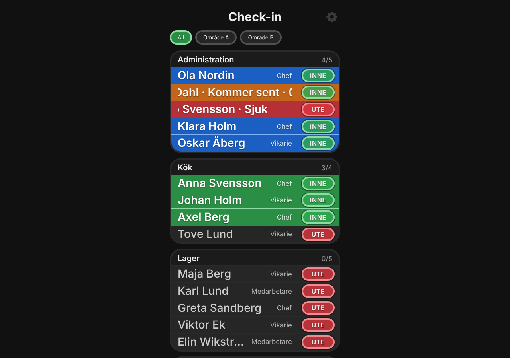
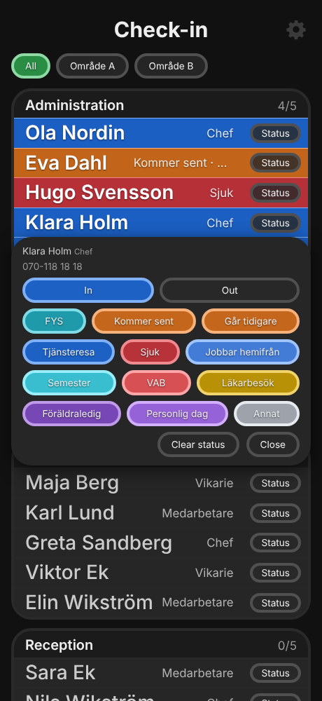

# Check-in board

A check-in board for a Raspberry Pi (or any Linux computer) that **several screens show in step**: who is in, who is out and why, in real time. The people come from a CSV file, and each one is a row that is grey while they are out and coloured while they are in, in the colour of their department or building. A small **Status** button next to it sets a status (sick, late, on a trip, holiday ...) which the button then shows in the status' own colour.

It is built on the module base of the DreamPi network switcher, and the board and its features follow [CheckinChicken](https://github.com/blaskkaffe/CheckinChicken) (a Node.js check-in board): same CSV columns, same statuses, same ideas (several buildings, a screen per building, kiosk screens). Everything the page shows is a module, so the rest of the base (clock, updates, reboot) is there too.

<p align="center"> </p>

What you get:
- **A box per department with a row per person.** The whole row, edge to edge in its box, is grey while the person is out and turns the department's colour while they are in. The **INNE** (green) / **UTE** (red) button at its right checks the person in or out. A tap on the row opens the **status menu** in the middle of the screen: photo (tap it to choose a picture), name, department, building, role and phone at the top, a cross to close, and the statuses (CheckinChicken's) as same-size buttons, three in a row. A status turns the row the status' colour and the name and status scroll round like a carousel. Large text: 60 people fit a 1080p screen in two columns (portrait) or three (landscape) with Max columns set to 2 or 3.
- **Colours by department and/or building**, picked from the page's palette (automatic, or your own pick for each department / building).
- **Screens in step in real time.** The Pi (the host) keeps everything; every other screen is only a browser that opens the host's address, in kiosk mode if you like (`kiosk/kiosk-browser.sh`). A change on one screen is on the others within about a second.
- **A screen per building:** with several buildings a row of chips picks what a screen shows (kept in that browser; `?location=Område A` in the address sets it).
- **Contacts:** import a CSV (a file or pasted text), export it again, switch people off, tap a person to edit their name, department, role, phone and building. The board can show each person's role and building (pick which ones), and has an optional on-screen number pad / keyboard for times, dates and notes.
- A **clock** (12 or 24-hour, `.beat`, world times and a time zone map), **update and reboot buttons** on the page and an optional **PIN** for them.

**Tested so far:** off the Pi only: unit tests (`sh tests/run.sh`) and the page driven in Chromium against a demo server (`sh tests/ui/run.sh`). See [docs/hardware-status.md](docs/hardware-status.md) for what has and has not been seen on real hardware.

## Install

On the host (a Raspberry Pi with Raspberry Pi OS, or another Debian-family Linux with `systemd`):
```
git clone https://github.com/blaskkaffe/DreamPiAutoToggle.git
cd DreamPiAutoToggle
git checkout checkin2.0
sudo ./install.sh
```
Then open **http://&lt;the host's name&gt;.local** or its IP address in a browser on the same network, open **Settings** (the cogwheel) > **Contacts** and import your people.

Other screens only need a browser: open the same address, or run `kiosk/kiosk-browser.sh <host>` (Chromium full screen; `kiosk/checkin-kiosk-autostart.desktop` starts it at every login, so a power cut is no problem). `./kiosk-browser.sh 192.168.1.20 "Område A"` pins that screen to one building.

### The CSV

```
name,department,role,phone,location,restrictToLocation
Anna Svensson,Kök,Kökschef,070-123 45 67,Område A,
Maja Berg,Servering,,,Område B,x
```
`name` is required; a person without a `department` goes under "No department". **`location` is the building** (CheckinChicken's "Område"). `restrictToLocation` (`1`, `true`, `yes`, `ja` or `x`) shows the person only on a screen that has their own building picked, never under "All". Lines starting with `#` are ignored; comma, semicolon or tab work; Swedish headers (`namn`, `avdelning`, `telefon`) are understood. Importing again updates people in place and **never deletes** anyone (tick "Switch off people that are not in the file" to take others off the board); who is in is kept. From a shell: `python3 modules/contacts/netswitch_contacts.py people.csv`.

### HTTPS

Some browsers refuse or keep upgrading plain `http://` pages, so the page is also served over HTTPS on port 443. A Pi on a home network can't get a certificate from a public authority, so the installer makes a self-signed one:

- The first time you open the `https://` address, the browser warns that the connection isn't private. Choose **Advanced** and **Proceed** (the wording varies); most browsers remember that choice for the address. (A kiosk screen is easier on plain `http://`.)
- The traffic is still encrypted; the warning only means no public authority vouches for the certificate.
- The certificate is valid for about 2 years (Apple devices won't accept longer). Running the installer renews it when it has less than 30 days left.

Options:
- `sudo ./install.sh 8080` puts the HTTP page on another port, if port 80 is taken.
- `sudo ./install.sh --https-port=8443` puts the HTTPS page on another port, and `--no-https` turns it off.
- `sudo ./install.sh --pin` asks for a PIN (`--pin=1234` gives it on the command line, which shows in the shell history); `--no-pin` removes it. See [Safety](#safety).

### Update

The page can do it for you while the **Reboot and Update** module is on: **Settings > System** (the Updates row) checks GitHub for a newer version of the add-on and **Update now** fetches and installs it (the checkout you installed from must be a git clone of a GitHub address). By hand:
```
cd ~/DreamPiAutoToggle && git pull && sudo ./install.sh
```
Settings, people and who is in are kept. An install over the old DreamPi network switcher removes its hook, buttons and LED service; the DreamPi itself was never changed.

### Safety

The web page runs on the Pi as root, because it has to reboot the Pi and run the updater. There are no user accounts: **anybody who can reach the page on your network can use it**, so only put the Pi on a network you trust, and don't forward its ports from the internet. What the add-on does to limit the risk:

- **PIN (optional).** `sudo ./install.sh --pin` sets a PIN that the page asks for (once per page load) before **Update now**, **Reboot** and a **contacts import**. It is stored only as a salted hash, and five wrong tries lock those actions for a minute. The PIN can also be set, changed or removed in **Settings > Appearance > PIN** (changing or removing it asks for the old one; while no PIN is set anybody on your network can set one there, which is why `sudo ./install.sh --no-pin` stays as the way back). **Ask for the PIN to open Settings** (same box) locks Settings: the cogwheel asks for the PIN and every change needs it, while tapping people in and out keeps working. Use the `https://` address when you use a PIN: over plain `http://` the PIN travels unencrypted. Forgot it? `sudo ./install.sh --no-pin`. Without a PIN, anybody on your network can update or reboot the Pi.
- **Other websites can't use it.** Every change (all `POST`s) must come from the page itself: a request from another site (a form or script on a web page you have open in your browser) is refused, and so is a request that reaches the Pi under a name that isn't the Pi's (the trick used to attack devices on a home network from a web page). The page answers to IP addresses, `.local`-style names and the Pi's own host name; if your router gives it another domain name and the page says "Unknown host name", list that name in `/opt/dreampi-netswitch/allowed_hosts` (one per line). The page can't be shown inside another site's frame.
- **Update now is limited to GitHub.** It only pulls from the git address the checkout had when the add-on was installed (it must be a GitHub address, and a changed one is refused), fetches from exactly that address, and only fast-forwards, so it can't pull in changes that don't continue your copy.
- **The web service is fenced in** (systemd: no new privileges, read-only `/usr`, `/boot` and `/etc`, no kernel-module or cgroup changes) and the add-on's files in `/opt/dreampi-netswitch` are root-owned.
- **Not covered:** anybody who can open the page can also tap people in and out and change the board: there is no per-person login (the PIN only guards the actions above); someone who is already logged in on the Pi (or can run code on it) can do more than this add-on ever could, and the status files in `/tmp` are guessable names (the update's status file is not written through a planted link).

### Modules

Everything the page shows is a module, one folder in `modules/`. **Settings > System > Modules** switches them and sets their order:

| Module | What it does | Default |
|---|---|---|
| Check-in board | The board: a box per department, a row per person, statuses, colours | on |
| Contacts | The people: CSV import and export | on |
| Clock | The time on the board page: 12 / 24-hour, `.beat`, world times, time zone map | on |
| About | Versions, the time zone, the global colours, a link to the project (always on) | on |
| Background image | A picture of your own as the page's background: choose it in Settings > Background image (big pictures are shrunk in the browser first), fit and darken it | **off** |
| Reboot and Update | Update the add-on from GitHub, reboot the Pi | on |

Developers: [docs/modules.md](docs/modules.md) (how to add or remove a module), [docs/checkin.md](docs/checkin.md) (the board and the contacts), [docs/web.md](docs/web.md). `CLAUDE.md` is the short guide for working on the code.

### Uninstall

`sudo /opt/dreampi-netswitch/uninstall.sh` removes the services and everything under `/opt/dreampi-netswitch`, **people and who is in included**. Export the contacts first (Settings > Contacts > Download).

## Requirements

- A computer for the host: a Raspberry Pi 3 or newer is plenty, running Raspberry Pi OS (or another Debian-family Linux with `systemd`), Python 3 (the Pi OS one is fine) and `git`. No Python packages and no internet are needed at run time (the update check and **Update now** need GitHub).
- A browser on every screen; the kiosk script assumes Chromium (`chromium-browser` or `chromium`).

## Web page

The main page is the board (and the clock box above it when that module is on). The cogwheel opens **Settings**:

- **Check-in board:** what to group by and what to colour by (department or building), a colour for every department and building (Automatic or your pick), **All out** (the start of the day) and **All in**.
- **Appearance / Global colours:** the module's colour, the global main colour, the highlight look, **Max columns** for the dashboard and for Settings (1 to 6; as many as fit at about 430 px each), **Stretch boxes** (the columns share the whole screen width) with **Scale content**, **Rearrange the main screen** (drag the tiles; the department boxes move too and their order is kept on the host, so every screen follows), **No scrolling** (the main screen never scrolls; Settings still does), and with more than one column a department with more people than fit under each other in the screen height is split into near-equal parts in the next columns, "Kök (1/2)", "Kök (2/2)", and the **PIN** with **Ask for the PIN to open Settings** (the board itself keeps working without it).
- **Contacts:** how many people, import (a file or pasted text), Export.
- **About:** versions, the address, the time zone, GitHub. **System:** Modules, Updates, Reboot.

The page works on a phone as well as a wall display: the dashboard is one column by default and uses as many columns as you allow in Appearance, each department box being a tile of its own.

## Checking it works

- The page shows red warning boxes at the top when something is wrong (a module that could not load).
- If the page doesn't open at all, the host may have no network connection. If it is unreachable now and then, or slow to open the first time: try the host's IP address instead of the `.local` name (looking up `.local` names can take a few seconds on some phones and PCs); Wi-Fi power saving is a common cause of a Pi dropping off the network (the service switches it off each time it starts; it resets on reboot).
- `journalctl -u dreampi-netswitch -n 50` shows whether the page service restarted or logged an error. It restarts itself within seconds if it ever stops answering.
- `curl http://localhost/api` shows what every screen is told (the `checkin` key is the whole board).

## Credits

The board, the statuses and the CSV format follow [CheckinChicken](https://github.com/blaskkaffe/CheckinChicken). The module base, the clock and the update / reboot controls come from the DreamPi network switcher this add-on grew out of; the names of the service and of `/opt/dreampi-netswitch` are still its.
